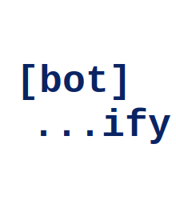

# Botify


Reusable Telegram ↔ Codex bridge that can be dropped into any repository. 

## Features
- Long-polling Telegram bot locked to a single chat.
- Full Codex MCP lifecycle management with automatic session reuse.
- Configurable sandbox, approval policy, Codex profile/model, and prompt overrides.
- Graceful shutdown and rich status/help commands exposed via Telegram.

## Installation

Choose the installation approach that best fits your workflow.

### Git Submodule
1. `git submodule add git@github.com:edoardoc/botify.git`
2. Run `npm install` inside the `botify/` folder.
3. Make sure `<host_project>/.codex_mcp_home/auth.json` contains valid Codex credentials.
4. Launch Botify from the `<host_project>` folder with `./botify/scripts/start-bot.sh`.

The launcher script reads `.env`, boots the compiled bridge, and mirrors output to `./logs/botify.log` (override via `BOTIFY_LOG_PATH=/custom/path.log`). Run it from the host project root so relative paths match—asking the bot to list the folder is a quick sanity check.

### Global npm CLI
1. Install the CLI once: `npm install -g github:edoardoc/botify` (or `npm install -g git+ssh://git@github.com/edoardoc/botify.git`).
2. Inside each host project, create a `.env` file using `.env.example` as a template.
3. Populate the required environment variables (see the configuration table below).
4. From the host project root, run `botify` to start the bridge. It treats the current directory as `CODEX_CWD` and writes artifacts to `<project>/.codex_mcp_home/`.
5. Optional: set `BOTIFY_LOG_PATH=./logs/botify.log botify` to tee output into your repo log directory.
6. Update later via `npm update -g botify`; `botify --version` shows the installed branch/commit.

```bash
npm install -g github:edoardoc/botify

# inside a host repo
BOTIFY_LOG_PATH=./logs/botify.log botify
```

## Configuration
1. Copy `.env.example` to `.env` and fill in the required variables:
   - `TELEGRAM_BOT_TOKEN` and `TELEGRAM_CHAT_ID` are mandatory.
   - Optional Codex overrides (command, sandbox, approval policy, etc.) can stay commented out until needed.
2. Export the `.env` or run the launcher/CLI from the same directory so it can auto-load the file.

Botify reads all settings from environment variables; defaults align with the original bridge:

| Variable | Description | Default |
| --- | --- | --- |
| `TELEGRAM_BOT_TOKEN` | Telegram bot token (from BotFather) | *required* |
| `TELEGRAM_CHAT_ID` | Numeric chat id allowed to talk to the bot | *required* |
| `TELEGRAM_POLL_TIMEOUT` | Long poll timeout in seconds | `25` |
| `CODEX_COMMAND` | Command used to launch the Codex MCP server | `codex mcp-server` |
| `CODEX_CWD` | Working directory for Codex | current working directory |
| `CODEX_HOME` | Dedicated Codex home directory | `<CODEX_CWD>/.codex_mcp_home` |
| `CODEX_SANDBOX` | Sandbox mode forwarded to Codex | `danger-full-access` |
| `CODEX_APPROVAL_POLICY` | Approval policy forwarded to Codex | `never` |
| `BOTIFY_ATTACHMENTS_DIR` | Directory where incoming Telegram files are saved | `<CODEX_CWD>/uploads` |
| `CODEX_PROFILE` | Optional Codex profile | unset |
| `CODEX_MODEL` | Optional Codex model override | unset |
| `CODEX_INCLUDE_PLAN_TOOL` | Enable/disable plan tool | unset |
| `CODEX_BASE_INSTRUCTIONS` | Override base instructions string | unset |
| `CODEX_CONFIG_OVERRIDES` | JSON payload forwarded as config overrides | unset |
| `CODEX_RPC_TIMEOUT_MS` | RPC timeout in milliseconds (`0` disables) | `900000` |
| `CODEX_EXIT_LOG_LINES` | Buffered lines from Codex logs for crash reports | `40` |
| `CODEX_OUTPUT_CHUNK` | Telegram message chunk size | `3500` |

## Credentials & Authorization

### Codex Authorization
Codex creates `<host_project>/.codex_mcp_home/auth.json` during `codex login`. Keep that file in sync with the bridge. If you see `Your access token could not be refreshed because your refresh token was already used`, run `codex logout && codex login` (or `codex auth login`) and copy the freshly generated `auth.json` back into this project before restarting Botify.

### Obtaining Telegram Keys
1. DM `@BotFather`, run `/newbot`, follow the prompts, and copy the resulting `TELEGRAM_BOT_TOKEN`.
2. Start a chat with the bot (or add it to a group) and send a dummy message.
3. Grab the chat identifier with `curl "https://api.telegram.org/bot<token>/getUpdates"` or `@userinfobot`; the numeric `id` becomes `TELEGRAM_CHAT_ID`.
4. Drop both values into `.env` or export them in your shell before launching the bridge.
5. Optional: `/setprivacy` in `@BotFather` if the bot needs to see all group messages.

#### Finding your `TELEGRAM_CHAT_ID`
1. Replace `<token>` with your bot token and run:
   ```bash
   curl "https://api.telegram.org/bot<token>/getUpdates"
   ```
2. Locate the most recent `message.chat.id` in the JSON response. That value (often negative for groups) is the `TELEGRAM_CHAT_ID`.
3. Optionally, pipe the result through `jq` to extract the id quickly:
   ```bash
   curl "https://api.telegram.org/bot<token>/getUpdates" | jq '.result[0].message.chat.id'
   ```
4. If you do not see the chat listed, send another message to the bot and re-run the command; Telegram only returns chats with recent activity.

## Usage
Start the bridge with `./botify/scripts/start-bot.sh` (submodule) or `botify` (global CLI), then interact with it through Telegram commands:

| Command | Description |
| --- | --- |
| `/help` | Show command list and a short bridge description. |
| `/ping` | Quick heartbeat that replies with `pong`. |
| `/status` | Report Codex readiness, queue length, timestamps, sandbox, and Botify version. |
| `/reset` | Drop the active Codex conversation and clear pending prompts. |
| `/relive` | Notify the chat that Botify is shutting down and exit with code 0 so a new build can restart. |
| (any other text) | Relayed to Codex via MCP; responses stream back as formatted messages. |

## Version Information
Every build captures the current Git branch and commit in `version-meta.json` and exposes it through the CLI:
- `botify --version` (or `botify -v`) prints `semver+branch.commit`, making it easy to audit what was installed globally.
- The same version string is advertised to Codex in the `clientInfo` payload so remote sessions can also see which build is active.
If Git metadata is unavailable during installation, the CLI falls back to the base `package.json` version and marks branch/commit as `unknown`.

## Attachment Handling
- Any Telegram document or photo sent to the bot is downloaded immediately and stored inside `BOTIFY_ATTACHMENTS_DIR` (default `./uploads` relative to the Codex CWD).
- Add this directory to your `.gitignore` (already ignored by default) so large binaries never end up in version control.
- When a file is saved, the bot sends back the relative path so you can reference it in follow-up prompts (e.g., “use `uploads/photo-abc123.jpg` as the hero image”).


## macOS Launch Agent

Change file `<YOUR_PATH>/projects/botify/.local/bin/start_all_bots.sh` with the bots you created, then change all absolute paths `/Users/eddy/...` with your paths in `com.botify.startbots.plist` then do a:

```
chmod +x ~/projects/botify/.local/bin/start_all_bots.sh
launchctl unload ~/Library/LaunchAgents/com.botify.startbots.plist 2>/dev/null || true
launchctl load  ~/Library/LaunchAgents/com.botify.startbots.plist
launchctl start com.botify.startbots
```

this will start all your bots at every boot

<p align="right">
  
</p>
